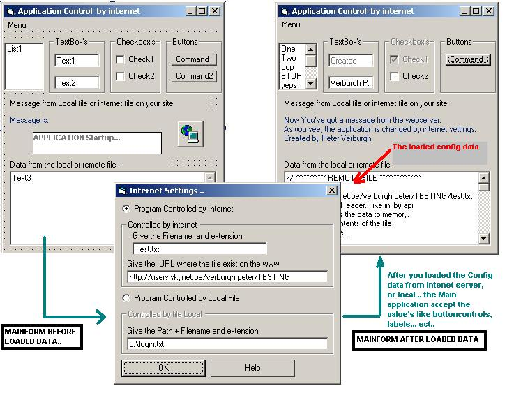



## Configure your Application by file on the Webserver \!\!

### Description

It configure the application by recieving data (a file) from a webserver/Website.

example, you start this program & the application will go to your site , downloads a file (config file) & then change the behavior of the application as my example , hidding buttons, changing a text label on the form , disabling checkbox's.. ect...

So you could write now applications , people start it up , retrieves a file from your site with updated value's , information ...

More information availible in the ZIP file Readme.txt

Check my other applications on PSC !

----

Dynamic Webserver UPDATED 

----

----

RS232 - DATALOOK 

----

Please Vote for me!
 
### More Info
 
I use the standard Inet control !

(standard in VB4-5-6)

             |
---                |---
**Submitted On**   |2001-07-01 18:46:24
**By**             |[Peter V\.](https://github.com/Planet-Source-Code/PSCIndex/blob/master/ByAuthor/peter-v.md)
**Level**          |Beginner
**User Rating**    |4.4 (48 globes from 11 users)
**Compatibility**  |VB 4\.0 \(32\-bit\), VB 5\.0, VB 6\.0
**Category**       |[Complete Applications](https://github.com/Planet-Source-Code/PSCIndex/blob/master/ByCategory/complete-applications__1-27.md)
**World**          |[Visual Basic](https://github.com/Planet-Source-Code/PSCIndex/blob/master/ByWorld/visual-basic.md)
**Archive File**   |[Configure 22002712001\.zip](https://github.com/Planet-Source-Code/peter-v-configure-your-application-by-file-on-the-webserver__1-24617/archive/master.zip)

